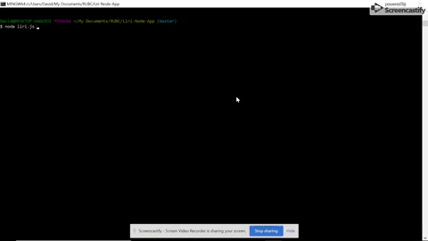

# Liri: Node App
 LIRI is a Node.js based app that users can run in a *command line interface* to search for concerts, movies, and music.
 Liri stands for: Language Interpretation and Recognition Interface.

### What it does
This app has four different search options:
1. Concert-this
  * If you select this option, you can search for concerts across the US

  

2. Song-this
  * If you select this option, you will return information on that track.

  

3. Movie-this
  * If you select this option, you will return information on that movie.

  

4. Do-it!
  * If you select this option, ands hit ENTER, you will get a random action from within the program.

  

* If you do not enter parameters for option 2: it will default-search __The Sign by Ace of Base__. *
* If you do not enter parameters for option 3: it will default-search __Mr Nobody__. *

  

##### How it works
This app uses Node.js technology to run in the command line. For my project - and all others - I use Git Bash as my CLI.

The project uses javascript and several node packages, including:
* Axios
* Moment
* Inquirer
* Node-Spotify-API

The Node-Spotify-API package handles the *Song-this* search. The other API's are:
* OMDB
* BandsInTown
